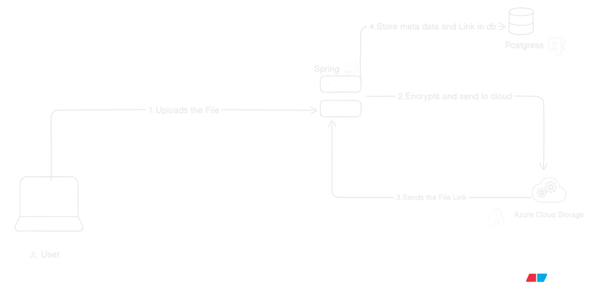
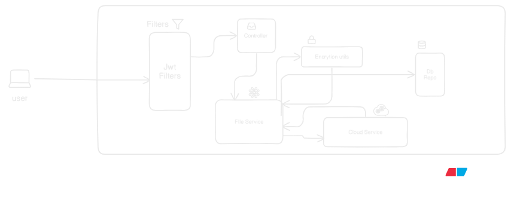

# Architecture Design

> High-Level Design (HLD) and internal request flows for the Decentralized Document Vault.



## 1. Process Flow

1. The user uploads a file via the frontend UI or a `curl` command.
2. The backend encrypts the data using AES/RSA cryptographic algorithms.
3. The encrypted bytes are streamed and saved into cloud storage.
4. The cloud storage returns a reference link, which is stored in the SQL database along with the file's metadata.

## 2. Backend Flow (Spring Boot)



### Request Lifecycle Breakdown

1. **Client Request:** The user sends the HTTP request containing the file.
2. **Security Filter Chain:** The request hits the filters, which check the authorization headers. If the JWT is valid, it proceeds; if not, it throws a 401 error.
3. **Controller Layer:** Upon successful authentication, the request reaches the Controller, which routes the payload to the `FileService`.
4. **Service & Cryptography Layer:** The `FileService` extracts the file stream and calls the Cryptography Utils to encrypt the file bytes.
5. **Cloud Integration:** The Service passes the encrypted file to the Cloud Utils, which upload it to Azure Blob Storage and return the storage link.
6. **Persistence Layer:** Finally, the Service class saves the cloud link along with the encrypted metadata into the PostgreSQL database.

## 3. Entity Relationship Diagram (ERD)

The relational data model is structured as follows:

```mermaid
erDiagram
    USERS ||--o{ DOCUMENTS : "uploads"
    USERS {
        uuid id PK
        string email
        string password_hash
        timestamp created_at
    }
    
    DOCUMENTS ||--o{ SHARED_LINKS : "generates"
    DOCUMENTS {
        uuid id PK
        uuid user_id FK
        string encrypted_title
        string azure_blob_key
        timestamp uploaded_at
    }
    
    SHARED_LINKS {
        uuid id PK
        uuid document_id FK
        string link_hash
        timestamp expires_at
        boolean is_active
    }